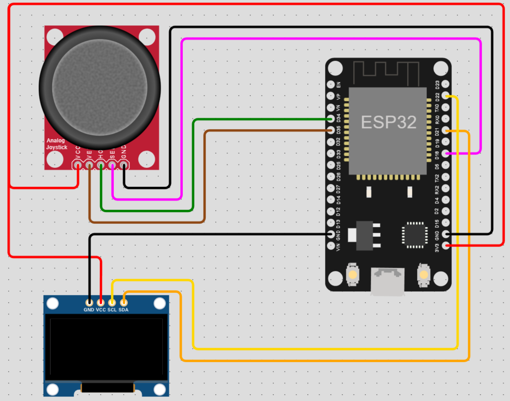

# Arduino Multiplayer Pong

This project is a multiplayer version of the classic game Pong, implemented on the ESP32 microcontroller. The game can be played by two players using two separate ESP32 modules, connected over Wi-Fi using the ESP NOW protocol.

<!-- TABLE OF CONTENTS -->
<details>
  <summary>Table of Contents</summary>
  <ol>
    <li><a href="#hardware-requirements">Hardware Requirements</a></li>
    <li><a href="#software-requirements">Software Requirements</a></li>
    <li><a href="#installation">Installation</a></li>
    <li><a href="#usage">Usage</a></li>
    <li><a href="#license">License</a></li>
  </ol>
</details>

## Hardware Requirements

The following hardware is required to run this project:
- 2 x ESP32 modules;
- 2 x OLED displays (SSD1306, 128x64 pixels);
- 2 x Joystick modules;

## Software Requirements

The following software is required to run this project:

- Visual Studio Code (https://code.visualstudio.com/download)
- PlatformIO extension for VS Code (https://marketplace.visualstudio.com/items?itemName=platformio.platformio-ide)
- Adafruit SSD1306 library for OLED displays, automatically installed if you use PlatformIO (https://github.com/adafruit/Adafruit_SSD1306)
- Adafruit GFX library, automatically installed if you use PlatformIO (https://github.com/adafruit/Adafruit-GFX-Library)
    
## Installation

1. Install Visual Studio Code, PlatformIO extension.
2. Install Espressif 32 platform from PlatformIO.
3. Clone the repository into your local machine.
4. Configure the circuit as shown in the image below.

5. Connect the ESP32 modules to your computer via USB.
6. Change the **L_MAC_1** and **L_MAC_2** inside src/network-manager.h according to the ESP32 MACs (you can obtain the MAC by reverse the result of the function `ESP.getEfuseMac()` or by usign the sketch belove).
```cpp
    #include <Arduino.h>
    #include <WiFi.h>

    void setup()
    {
        Serial.begin(115200);

        uint64_t mac = ESP.getEfuseMac();
        uint8_t macArray[6];
        for (int i = 0; i < 6; i++)
        {
            macArray[5 - i] = (mac >> ((5 - i) * 8)) & 0xFF;
        }

        char macStr[18];
        snprintf(macStr, 18, "%02x:%02x:%02x:%02x:%02x:%02x", macArray[0], macArray[1], macArray[2], macArray[3], macArray[4], macArray[5]);
        Serial.print("\n\nThe MAC address is: ");
        Serial.println(macStr);
    }

    void loop() {}
```
8. Compile and upload the sketch to each ESP32 module.
    

## Usage

To start the game, players must press the joystick's button. Once the game has begun, they can move their paddle up and down using the joystick in an attempt to hit the ball. The goal is to prevent the ball from hitting the side bar of their own court, as doing so will result in the opponent earning a point.

The game is won by the player who is the first to reach a total of 10 points. If a player needs to take a break or wants to pause the game, they can do so at any time by pressing the joystick button. This feature allows players to take a quick break, gather their thoughts, or attend to any other necessary tasks.

Once a game has been completed, players can start another one by simply clicking the button on the joystick. This feature enables quick and easy setup for multiple games, allowing players to continue playing without any delays or interruptions.


## License

This project is licensed under the MIT License - see the LICENSE file for details.
